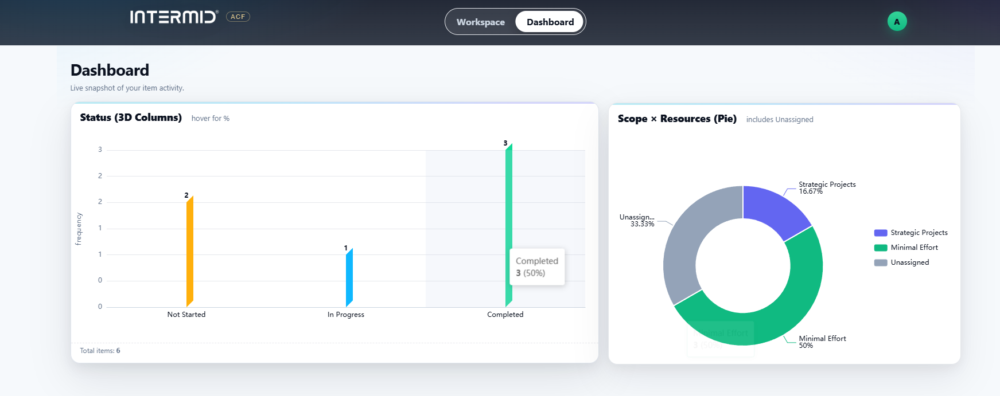

# INTERMID ACF

> A full-stack app that digitizes **INTERMID’s Action Cycle Framework**.

---

## 🧩 Overview

- **Workspace**: Left Process Flow → Middle Action Table → Right 2×2 Matrix (drag & drop)  
- **Dashboard**: Live KPIs + per-item charts  
- **Roles**: `admin`, `manager`, `team` (limited editing)  
- **Exports**: CSV / PDF (per stage)  
- **Auth**: Header token (dev only)  
- **Database**: SQLite file with schema + sample items  

---

## 📸 Screenshot



---

## 🚀 Quick Start

```bash
# Backend
cd backend
npm install
npm run dev     # http://localhost:3001

# Frontend
cd frontend
npm install
npm run dev     # http://localhost:5173
```

---

## ⚙️ Tech Stack

- **Frontend**: React + Vite (plain CSS)  
- **Backend**: Node.js (Express)  
- **Database**: SQLite  
- **Auth**: In-memory session token  
- **Ports**: Web 5173, API 3001 (`/api` proxy)  
- **Schema Fields**:  
  `id`, `number`, `title`, `factor`, `action`, `scope`, `time`, `resources`, `exec_status`, `notes`, `current_step`, `created_at`, `updated_at`

---

## 🎯 Feature Breakdown

### Workspace

| Panel       | Functionality                                                           |
|-------------|-------------------------------------------------------------------------|
| Left        | Process Flow: Item → Factor → Action → Scope / Time / Resources → Status |
| Middle      | Action Table: inline editing of title, factor, scope, status, etc.       |
| Right       | 2×2 Matrix: drag cards between Scope × Resources quadrants               |

---

### Dashboard

- KPI cards for: **Total**, **Completed**, **In Progress**, **Delayed**  
- Per-item colored bars + quadrant donut chart

---

### Roles & Permissions

| Role    | Access                                |
|---------|----------------------------------------|
| admin   | Full access                            |
| manager | Full access                            |
| team    | Can only update `status`, `notes`      |

---

### Export

- CSV & PDF export of current stage only

---

## 📄 MIT License

```
MIT License

Copyright (c) 2025 Ahmad Raza

Permission is hereby granted, free of charge, to any person obtaining a copy
of this software and associated documentation files (the “Software”), to deal
in the Software without restriction, including without limitation the rights
to use, copy, modify, merge, publish, distribute, sublicense, and/or sell
copies of the Software, and to permit persons to whom the Software is
furnished to do so, subject to the following conditions:

THE SOFTWARE IS PROVIDED “AS IS”, WITHOUT WARRANTY OF ANY KIND.
```
